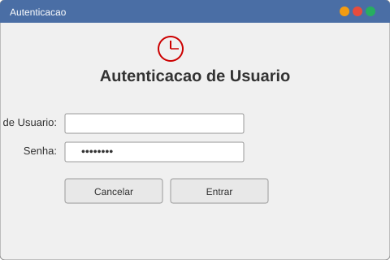
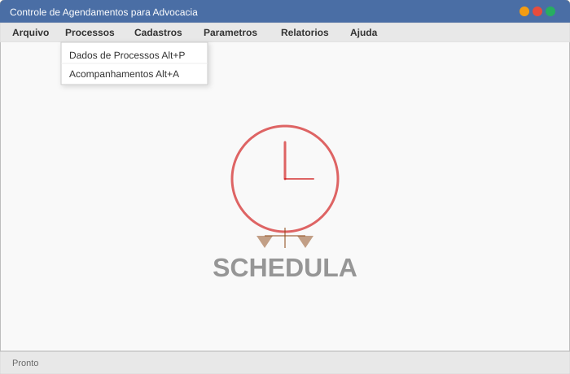
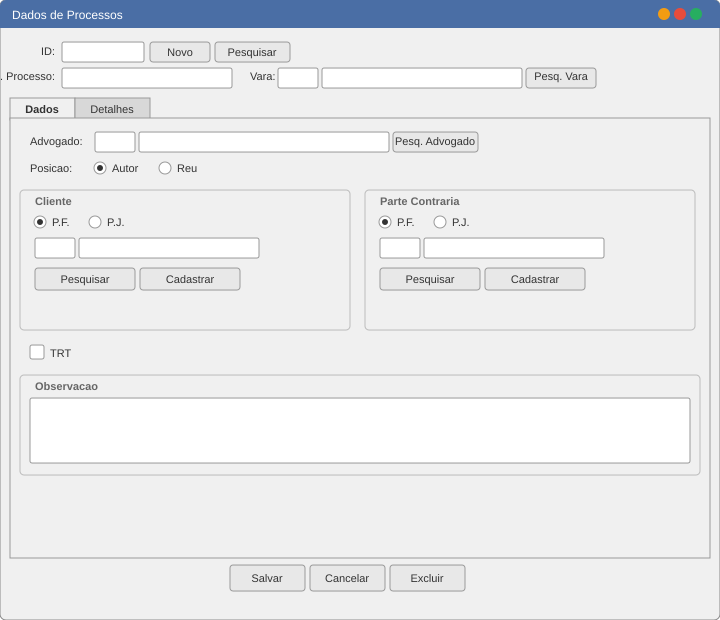
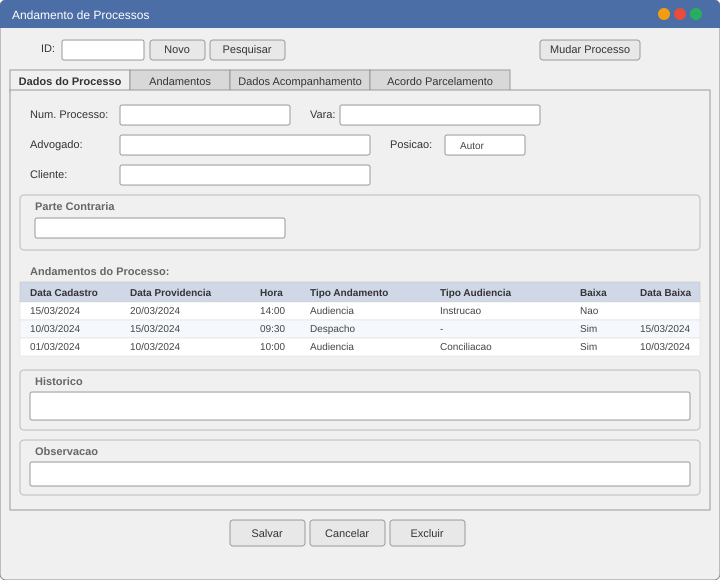
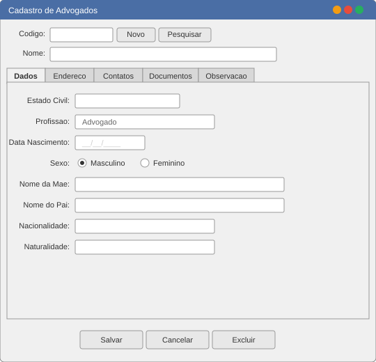
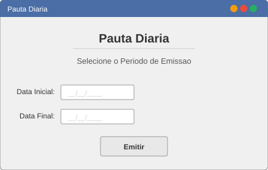
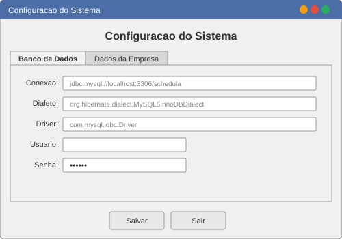

# Schedula

[](https://www.gnu.org/licenses/gpl-3.0)

Sistema desktop para gestão de agenda de escritórios de advocacia, com especialização em direito trabalhista.

## Funcionalidades principais

- **Cadastro de Processos** — controle completo de processos trabalhistas, com número, vara, reclamante, reclamado e advogado responsável
- **Acompanhamento Processual** — registro de andamentos, audiências, prazos e providências
- **Cadastro de Pessoas Físicas** (reclamantes) — dados pessoais, documentos (CPF, RG, CTPS), endereço e contatos
- **Cadastro de Pessoas Jurídicas** (reclamados) — razão social, CNPJ, inscrição estadual, sócios
- **Cadastro de Advogados** — dados profissionais, OAB, endereço
- **Comarcas e Varas** — organização judiciária
- **Acordos e Parcelas** — controle financeiro de acordos trabalhistas
- **Pauta Diária** — relatório de compromissos e audiências do dia (JasperReports)
- **Controle de Usuários e Permissões** — autenticação com hash MD5, habilitações por funcionalidade
- **Configuração do Sistema** — tela de configuração de conexão com banco de dados
- **Migração Legada** — importação de dados do sistema ATDB (Firebird) para o Schedula (MySQL)

## Pré-requisitos

- **Java** 6 ou superior (JRE/JDK)
- **MySQL** 5.x com um banco de dados `schedula` criado

## Instalação e configuração

### 1. Banco de dados

Crie o banco de dados MySQL:

```sql
CREATE DATABASE schedula CHARACTER SET utf8 COLLATE utf8_general_ci;
```

As tabelas são criadas automaticamente pelo Hibernate na primeira execução, ou podem ser populadas pela classe `SchedulaInstalacao.java`.

### 2. Configuração do Hibernate

Edite o arquivo `src/br/com/perettis/schedula/model/hibernate.cfg.xml` e substitua os placeholders:

- `<hostexemplo>` — endereço e porta do MySQL (ex: `localhost:3306`)
- `<userexemplo>` — usuário do banco de dados
- `<senhaexemplo>` — senha do banco de dados

### 3. Configuração do Schedula

Edite o arquivo `env/CONF/SchedulaConfig.xml` com os mesmos dados de conexão. Alternativamente, use a tela de configuração do sistema na primeira execução.

## Execução

```bash
java -jar dist/schedula.jar
```

> **Nota:** o diretório `dist/lib/` contém todas as dependências necessárias e deve estar no mesmo nível que `schedula.jar`.

## Estrutura do projeto

```
schedula/
├── src/br/com/perettis/schedula/
│   ├── entity/          # Entidades Hibernate (POJOs + mapeamentos .hbm.xml)
│   ├── model/           # DAOs, HibernateUtil, segurança, hibernate.cfg.xml
│   ├── reports/         # Templates JasperReports (.jrxml / .jasper)
│   ├── resources/       # Imagens e recursos da interface
│   ├── versoes/         # Scripts de migração do sistema legado ATDB (Firebird)
│   ├── *.java / *.form  # Telas Swing (formulários e pesquisas)
│   └── SchedulaApp.java # Classe principal da aplicação
├── env/CONF/            # Arquivos de configuração XML
├── dist/                # JAR compilado + bibliotecas
│   ├── schedula.jar
│   └── lib/             # 24 dependências JAR
├── build.xml            # Script de build Apache Ant
├── nbproject/           # Configuração do NetBeans IDE
└── docs/                # Documentação técnica
```

## Telas do sistema

### Splash Screen


### Autenticação


### Tela Principal


### Cadastro de Processos


### Andamento de Processos


### Cadastro de Advogados


### Pauta Diária


### Configuração do Sistema


## Licença

Este projeto é licenciado sob a **GNU General Public License v3.0** — veja o arquivo [LICENSE](LICENSE) para detalhes.

## Autor

**Vinicius Peretti** — [github.com/vperetti](https://github.com/vperetti)
